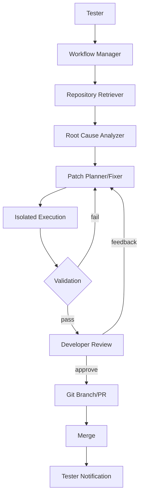

# AutoResolve Architecture

## Workflow

## Security boundary

LLM output is treated as untrusted. Patch application, test execution, Git operations and merge are controlled by application code. Production execution should use Docker with network restrictions and resource limits.
